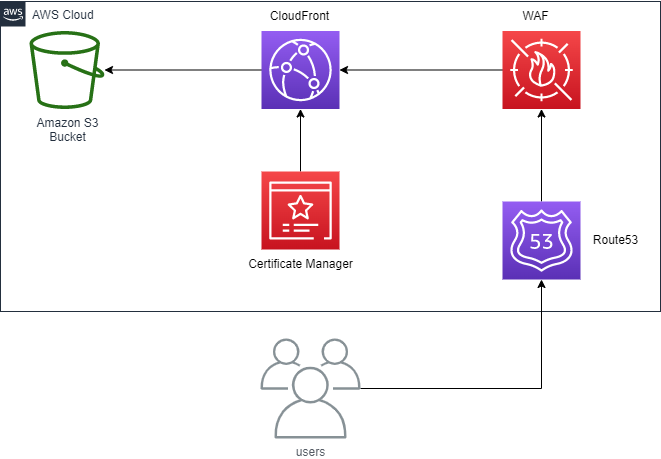

# Infrastructure as Code (IaC)

## Prelimanary Steps

These steps are done manually for inital setup:

### AWS Account
- [X] Create an AWS account
- [X] Create AWS Access Key Pair for Github
- [X] Put AWS Access Key Pair in repo's secrets

### Transfer Domain
- [X] Domain was registered in another account, therefore transfer ownership to this account (manual, time consuming)
- [X] Manually configure the ACM certificates for the domain  (this  is also part of Terraform now)

### Terraform the Backend
- [X] Create Terraform backend
  - [X] S3 Bucket for state files (terraform-state-for-nubadoo-com)
    - [X] Enable versioning on bucket
  - [X] Creeate the DynamoDB table (terraform-state-for-nubadoo-com)
  - [X] See repo **terraform-backed** for Terraform code to perform this
  - [X] Run the GH Actions workflow "DEPLOY Terraform Backend" _manually_ from the GH console (only ever run this once ❗)
  - [X] Successfully run - the backend is in place 🧑‍🚀
  - [X] Cannot destroy with terraform as it is not in state files
    - [X] If run with Github Action destroy manually,
    - [X] Alternatively  clone repo and run from local machine and retain state
     
The AWS account is setup, the domain is ready, the Terraform backend is in place... All set 🚀
     
#### Sources: 
- [https://www.youtube.com/watch?v=FTgvgKT09qM](https://www.youtube.com/watch?v=FTgvgKT09qM)
- [https://angelo-malatacca83.medium.com/aws-terraform-s3-and-dynamodb-backend-3b28431a76c1](https://angelo-malatacca83.medium.com/aws-terraform-s3-and-dynamodb-backend-3b28431a76c1)

## AWS Infra

### S3 Static Hosting (aws-infra)

The following components are in terraform solution:

1. acm.tf - this creates a certificate in ue-east-1 (Virginia region).  This is so that the solution has certificates for SSL traffic.
2. cloudfront.tf - this create a CloudFront CDN. It distributes content efficiently and has security features like WAF.
3. main.tf - this file has the providers and we also specify the backend details - this will change
4. outputs.tf - this file gives us access to technical details we need about the solution
5. route53.tf - this configures the DNS records to point at the right places
6. s3.tf - this creates a bucket with a configuration designed for hosting static websites
7. variables.tf - these are variables / parameters we want to pass into the terraform before it runs
8. TO DO : Cloud Front Functions

An image of the solution:

Static hosting is set up for each of the subdomains...

## Elephant SQL Infra

### Database

1. The Terraform module in **elephant_sql_infra/main.tf** create an instance of a **tiny_turtle** (free) database in eu-west-1 (Ireland)

Note: This doesn't destroy from Github Actions workflow... Better to use local Terraform run for this whole solution.

## Github Actions

These are launched manually so as not to destroy infra that is already in place.

## Note

Not a perfect IaC implementation as some of the more tedious parts could be automated like passing credentials around and also doing the CDN refresh and and CDN functions.  But sufficient to demonstrate the IaC capabilities of the agile devops pieplines.  The rest of the things are enhancements to improve efficiency.
